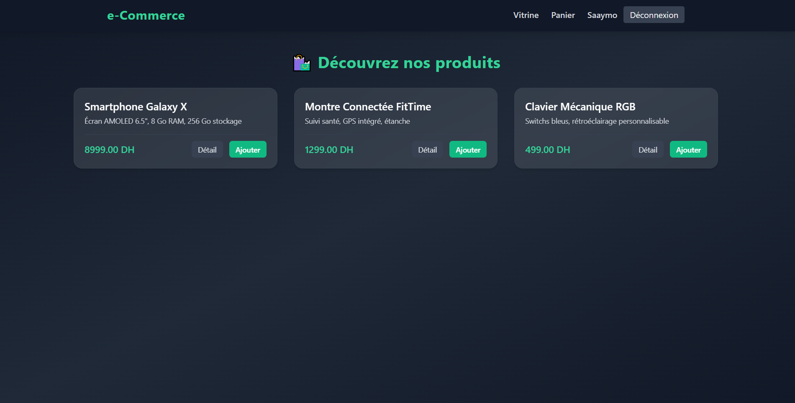
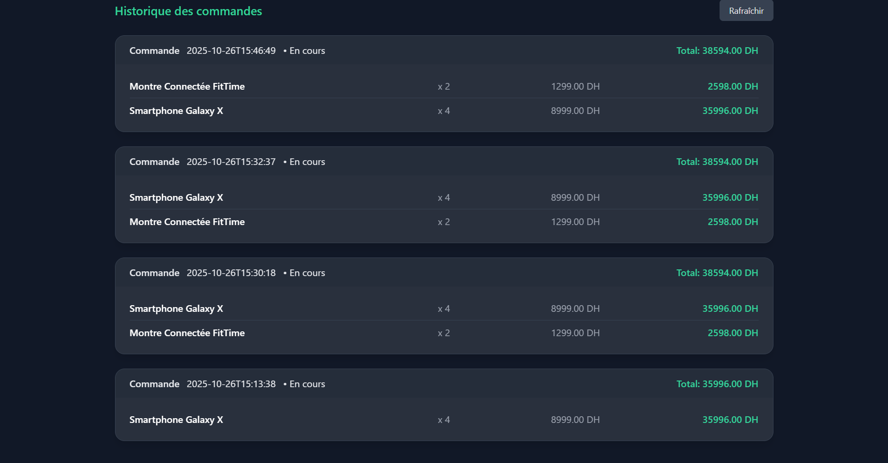

# e-commerceJSF - Atelier 3

## 📖 Description du Projet

Ce projet est une application web d'e-commerce simple développée en utilisant la spécification **Jakarta EE** (anciennement Java EE), avec **Jakarta Server Faces (JSF)** pour la couche de présentation et **Jakarta Persistence API (JPA) / Hibernate** pour la gestion des données.

L'application permet aux utilisateurs de parcourir un catalogue de produits, de gérer un panier d'achat, de se connecter/s'inscrire et de valider des commandes.

## ⚙️ Technologies Utilisées

* **Langage :** Java (JDK 21)
* **Framework Web :** Jakarta Server Faces (JSF 4.0)
* **Persistance :** Jakarta Persistence API (JPA)
* **Implémentation JPA :** Hibernate ORM (v7.0.4.Final)
* **Injection de dépendances :** CDI (Contexts and Dependency Injection)
* **Base de données :** MySQL (configuration via `hibernate.dialect` et `jta-data-source`)
* **Build Tool :** Apache Maven
* **Front-end Styling :** Tailwind CSS (utilisé via CDN dans les fichiers XHTML)

## ✨ Fonctionnalités

Le projet implémente les fonctionnalités de base d'une plateforme d'e-commerce :

1.  **Authentification et Enregistrement :**
    * Les utilisateurs peuvent se connecter ou créer un compte (`AuthBean`).
    * La connexion charge automatiquement le panier de l'utilisateur (`AuthBean`).
2.  **Vitrine (Catalogue de produits) :**
    * Affichage de la liste des produits disponibles (`VitrineBean`, `vitrine.xhtml`).
    * Possibilité de visualiser les détails d'un produit et de l'ajouter au panier.
3.  **Panier d'achat :**
    * Ajout de produits au panier (`PanierBean.ajouterAuPanier`).
    * Modification de la quantité d'un article ou suppression d'une ligne de panier (`PanierBean.modifierQuantite`, `PanierBean.supprimerDuPanier`).
    * Calcul du sous-total par ligne et du total du panier.
4.  **Passage à la Caisse :**
    * Affichage d'un résumé du panier et saisie de l'adresse de livraison (`caisse.xhtml`).
    * Validation de la commande : création d'une `Commande`, archivage des produits dans des `LigneCommande` (snapshot), et vidage du `Panier` (`CommandeBean.validerCommande`).
    * Page de confirmation après la validation (`confirmation.xhtml`).
5.  **Espace Compte :**
    * Affichage des informations personnelles de l'utilisateur.
    * Affichage de l'historique des commandes, y compris les détails des lignes de commande (produit, prix unitaire au moment de l'achat, quantité, sous-total).

## 🏗️ Structure des Classes JPA (Modèles)

Le diagramme de classes ci-dessous illustre les relations entre les entités JPA :

* **`Internaute`** (Utilisateur) : Possède un `Panier` (1:1) et peut passer plusieurs `Commande`s (1:N).
* **`Produit`** : Fait l'objet de plusieurs `LignePanier` et est archivé dans les `LigneCommande`s.
* **`Panier`** : Contient plusieurs `LignePanier` (1:N).
* **`Commande`** : Contient plusieurs `LigneCommande` (1:N).
* **`LignePanier`** : Représente la quantité d'un `Produit` dans le `Panier`.
* **`LigneCommande`** : Contient les informations figées (snapshot) du produit au moment de l'achat (ID, Nom, Prix Unitaire) pour l'historique.

## 🚀 Installation et Démarrage

### Prérequis

1.  **JDK 21** ou supérieur.
2.  **Apache Maven**.
3.  Un **Serveur d'Applications Jakarta EE** compatible (ex: WildFly, Payara, GlassFish).
4.  Une base de données **MySQL** configurée.

### Configuration

1.  **DataSource JTA :** Assurez-vous que votre serveur d'applications a configuré une source de données JTA nommée `java:jboss/datasources/MySqlDSJSF` qui pointe vers votre base de données MySQL.
    * *Note :* Le nom est spécifique à l'environnement JBoss/WildFly, comme indiqué dans `persistence.xml`.
2.  **Persistance :** Le fichier `src/main/resources/META-INF/persistence.xml` est configuré pour :
    * Utiliser la source de données JTA ci-dessus.
    * Utiliser le dialecte `org.hibernate.dialect.MySQLDialect`.
    * Mettre à jour automatiquement le schéma de la base de données (`hibernate.hbm2ddl.auto` fixé à `update`).

### Compilation et Déploiement

1.  **Cloner le dépôt :**
    ```bash
    git clone <https://github.com/SALHI-1/atelier3_JSF.git>
    cd <atelier3_JSF>
    ```
2.  **Compiler le projet (générer le fichier `.war`) :**
    ```bash
    ./mvnw clean package
    ```
3.  **Déploiement :** Déployez le fichier `.war` généré (ex: `target/e-commerceJSF-1.0-SNAPSHOT.war`) sur votre serveur d'applications.

L'application sera accessible à l'URL de votre déploiement, avec une redirection vers la vitrine (`index.xhtml` redirige vers `vues/vitrine.xhtml`).

## 🖼️ Aperçu (Screenshots)

Des exemples d'interface sont disponibles dans le répertoire `docs/`.

* 
* 
* 


